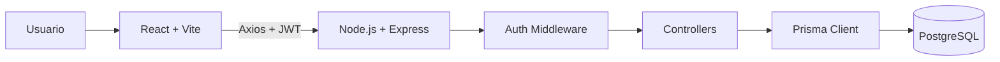
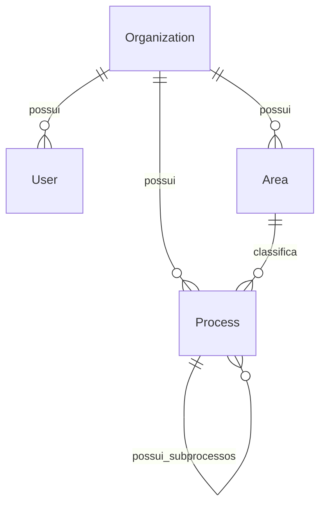

# Apresentacao Tecnica - ProcessHub

## 1. Resumo executivo

ProcessHub e uma aplicacao full stack para gestao de processos corporativos em modelo SaaS multi-tenant. O produto organiza areas, processos, subprocessos, responsaveis, prioridades, status e documentacao operacional dentro de workspaces isolados por empresa.

O objetivo do projeto e demonstrar dominio de arquitetura web moderna: frontend React, API REST com Node.js e Express, persistencia PostgreSQL com Prisma, autenticacao JWT, isolamento por tenant e deploy cloud.

## 2. Problema

Em muitas empresas, processos ficam distribuidos entre planilhas, documentos, fluxogramas, mensagens e ferramentas sem padrao. Isso cria alguns problemas:

- baixa visibilidade sobre status e prioridade;
- dificuldade para saber quem e responsavel por cada etapa;
- documentacao operacional espalhada;
- pouca rastreabilidade entre processos e subprocessos;
- risco de misturar dados de diferentes unidades ou clientes.

## 3. Solucao proposta

O ProcessHub centraliza a gestao operacional em um workspace unico por organizacao.

A solucao entrega:

- cadastro de workspace e usuario;
- areas da empresa;
- processos e subprocessos em arvore;
- pipeline visual por status;
- dashboard com indicadores;
- detalhes completos de cada processo;
- isolamento seguro por organizacao.

## 4. Diferenciais tecnicos

- **Multi-tenancy real:** todos os dados privados sao filtrados por `organizationId`.
- **Hierarquia recursiva:** processos podem ter subprocessos em multiplos niveis.
- **Kanban operacional:** processos sao visualizados e movimentados por status.
- **API protegida:** rotas privadas exigem JWT.
- **Seguranca de senha:** bcrypt armazena apenas hash.
- **Prisma ORM:** schema tipado, migrations e relacoes claras.
- **Separacao full stack:** frontend e backend independentes, prontos para deploy separado.

## 5. Arquitetura geral



Responsabilidades:

- **Frontend:** interface, rotas protegidas, sessao, dashboard e consumo REST.
- **Backend:** regras de negocio, autenticacao, autorizacao, validacoes e endpoints.
- **Banco:** persistencia relacional, integridade e hierarquia de processos.
- **Docker:** PostgreSQL local padronizado.
- **Cloud:** Vercel, Render e Neon como alvo de deploy.

## 6. Modelo de dados



Entidades:

- **Organization:** empresa ou workspace.
- **User:** usuario autenticado.
- **Area:** unidade, departamento ou setor.
- **Process:** processo ou subprocesso.

Trecho central do modelo:

```prisma
model Process {
  id             String    @id @default(uuid())
  name           String
  status         String?
  priority       String?
  executionType  String?
  organizationId String
  areaId         String
  parentId       String?

  parent   Process?  @relation("ProcessHierarchy", fields: [parentId], references: [id])
  children Process[] @relation("ProcessHierarchy")
}
```

Essa lista de adjacencia permite representar arvores profundas sem criar tabelas extras para cada nivel.

## 7. Multi-tenancy

O tenant da plataforma e a `Organization`.

Depois do login, o token carrega:

```ts
{
  userId,
  organizationId
}
```

O middleware valida o JWT e injeta o usuario autenticado na request. A partir disso, controllers privados usam o `organizationId` para filtrar dados:

```ts
where: {
  organizationId: req.user.organizationId
}
```

Com isso, uma empresa nao acessa areas, processos ou subprocessos de outra empresa.

## 8. Backend

Stack:

- Node.js
- Express
- TypeScript
- Prisma
- PostgreSQL
- JWT
- bcrypt

Principais responsabilidades:

- cadastrar usuario e workspace;
- autenticar credenciais;
- gerar token JWT;
- proteger rotas privadas;
- validar pertencimento de area e processo ao workspace;
- impedir ciclos na arvore de subprocessos;
- montar a arvore recursiva em `/processes/tree`;
- excluir processos com descendentes quando necessario.

## 9. Frontend

Stack:

- React
- TypeScript
- Vite
- Tailwind CSS
- Axios
- React Router DOM
- dnd-kit
- Lucide React

Principais telas:

- **Auth:** login e cadastro.
- **Dashboard:** indicadores de areas, processos, prioridades e status.
- **Areas:** CRUD de areas.
- **Processos:** cadastro, filtros, pipeline Kanban e drawer de detalhes.

## 10. Experiencia de usuario

A interface foi desenhada para uma ferramenta SaaS corporativa:

- sidebar com workspace, usuario e navegacao;
- dashboard compacto e escaneavel;
- filtros por area;
- pipeline com colunas de status;
- cards com prioridade, tipo, responsavel e data;
- detalhes laterais sem sair do contexto;
- suporte a desktop e mobile.

O Process Explorer e a principal experiencia do produto. Ele permite acompanhar processos em quatro estados:

- Aberto;
- Em Andamento;
- Em Revisao;
- Concluido.

## 11. Endpoints principais

| Metodo | Rota | Descricao | Auth |
| --- | --- | --- | --- |
| POST | `/auth/register` | Cria usuario e workspace | Nao |
| POST | `/auth/login` | Autentica usuario | Nao |
| GET | `/auth/me` | Retorna sessao autenticada | Sim |
| PUT | `/auth/workspace` | Atualiza workspace | Sim |
| DELETE | `/auth/workspace` | Exclui workspace | Sim |
| GET | `/areas` | Lista areas | Sim |
| POST | `/areas` | Cria area | Sim |
| PUT | `/areas/:id` | Atualiza area | Sim |
| DELETE | `/areas/:id` | Remove area | Sim |
| GET | `/processes` | Lista processos | Sim |
| GET | `/processes/tree` | Retorna arvore de processos | Sim |
| POST | `/processes` | Cria processo ou subprocesso | Sim |
| PUT | `/processes/:id` | Atualiza processo | Sim |
| DELETE | `/processes/:id` | Remove processo | Sim |

Rotas privadas:

```http
Authorization: Bearer <token>
```

## 12. Seguranca

- Senhas com hash bcrypt.
- JWT assinado com `JWT_SECRET`.
- Middleware de autenticacao nas rotas privadas.
- Token com `userId` e `organizationId`.
- Controllers filtram dados por workspace.
- Areas e processos precisam pertencer a organizacao autenticada.
- Processo pai precisa estar no mesmo workspace.
- Validacao contra ciclos na hierarquia.
- Exclusao de workspace usa cascade no banco.

## 13. Ambiente local

Subir banco:

```bash
docker compose up -d
```

Rodar backend:

```bash
cd backend
npm install
npx prisma migrate dev
npm run seed:demo
npm run dev
```

Rodar frontend:

```bash
cd frontend
npm install
npm run dev
```

Credenciais demo:

```text
demo@processhub.com
123456
```

## 14. Deploy

Arquitetura sugerida:

- **Frontend:** Vercel.
- **Backend:** Render.
- **Banco:** Neon PostgreSQL.

Variaveis importantes:

```env
DATABASE_URL=postgresql://...
JWT_SECRET=...
PORT=3333
VITE_API_URL=https://sua-api.com
```

Observacao: no plano gratuito do Render, a primeira requisicao pode demorar alguns segundos quando a API esta inativa.

## 15. Como apresentar o projeto

Roteiro recomendado:

1. Explicar o problema de processos espalhados.
2. Mostrar que cada empresa possui um workspace isolado.
3. Fazer login com o usuario demo.
4. Apresentar a sidebar e o workspace.
5. Mostrar o Dashboard.
6. Criar ou editar uma area.
7. Criar um processo raiz.
8. Criar um subprocesso vinculado.
9. Abrir o Process Explorer.
10. Mover um card entre status.
11. Abrir o drawer de detalhes.
12. Destacar isolamento multi-tenant e validacoes do backend.

## 16. Qualidade

Comandos de validacao:

```bash
cd backend
npm run build

cd ../frontend
npm run lint
npm run build
```

## 17. Decisoes tecnicas

- **REST em vez de GraphQL:** suficiente para o escopo e mais simples de demonstrar.
- **JWT stateless:** facilita separacao entre frontend e backend.
- **Prisma:** reduz boilerplate e deixa o modelo relacional explicito.
- **Lista de adjacencia para processos:** permite hierarquia flexivel.
- **Frontend separado:** aproxima o projeto de um deploy full stack real.
- **Tailwind CSS:** velocidade para criar uma interface SaaS consistente.

## 18. Evolucoes futuras

- Convite de usuarios para workspace.
- Controle de acesso por papel.
- Recuperacao de senha.
- Refresh token.
- Busca global.
- Filtros avancados.
- Historico de alteracoes.
- Upload de documentos.
- Comentarios nos processos.
- Testes automatizados.

## Fechamento

ProcessHub demonstra uma base solida de produto SaaS: autenticacao, multi-tenancy, CRUD completo, arvore recursiva, dashboard, pipeline operacional e separacao entre frontend, backend e banco de dados.
