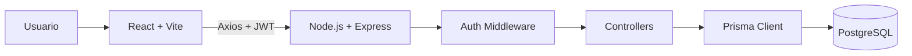
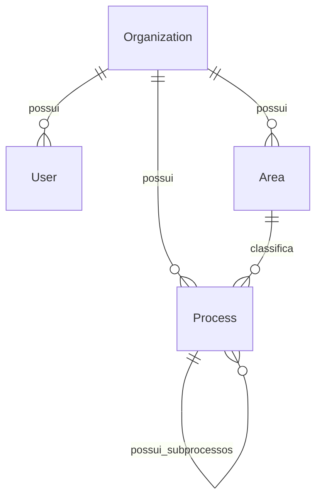

# Apresentacao Tecnica - ProcessHub

## 1. Abertura

O ProcessHub e uma aplicacao full stack para gestao de processos corporativos.

A ideia do projeto foi criar uma plataforma SaaS multi-tenant onde cada empresa tem seu proprio workspace e consegue organizar areas, processos, subprocessos, prioridades, responsaveis, status e documentacao em um unico lugar.

Em uma apresentacao, eu resumiria o projeto assim:

> O ProcessHub transforma processos espalhados em planilhas, documentos e mensagens em uma plataforma centralizada, visual e segura para acompanhar a operacao de uma empresa.

## 2. O problema

Em muitas empresas, os processos internos nao ficam organizados em um sistema unico. Normalmente eles ficam distribuidos em:

- planilhas;
- documentos soltos;
- fluxogramas estaticos;
- mensagens em chats;
- ferramentas diferentes para cada area;
- conhecimento informal de pessoas especificas.

Isso gera alguns problemas praticos:

- fica dificil saber qual processo esta em andamento;
- nao existe clareza sobre responsaveis;
- a documentacao fica espalhada;
- processos e subprocessos perdem relacao entre si;
- gestores nao tem uma visao rapida da operacao;
- empresas diferentes ou unidades diferentes podem misturar informacoes se nao houver isolamento.

O problema central que eu quis resolver foi:

> Como centralizar a gestao de processos de uma empresa, mantendo organizacao, rastreabilidade, seguranca e uma boa experiencia de uso?

## 3. Como eu resolvi

Eu resolvi criando o ProcessHub como uma plataforma web com separacao clara entre frontend, backend e banco de dados.

A solucao foi dividida em cinco partes principais:

1. **Workspace por empresa**

Cada organizacao possui seu proprio ambiente. Depois do cadastro, o usuario entra em um workspace isolado, onde ficam suas areas e seus processos.

2. **Cadastro de areas**

As areas representam departamentos ou setores da empresa, como RH, Financeiro, Operacoes ou Comercial. Elas ajudam a classificar os processos.

3. **Processos e subprocessos**

O sistema permite criar processos principais e tambem subprocessos em varios niveis. Isso foi feito com uma hierarquia recursiva no banco, usando `parentId` e `children`.

4. **Acompanhamento visual**

Os processos aparecem no Process Explorer, com visualizacao por area, arvore hierarquica, cards e pipeline Kanban por status:

- Aberto;
- Em Andamento;
- Em Revisao;
- Concluido.

5. **Seguranca multi-tenant**

Todas as rotas privadas usam autenticacao JWT. O backend identifica a organizacao do usuario logado e filtra os dados por `organizationId`, garantindo que um workspace nao acesse dados de outro.

## 4. Tecnologias usadas e por que escolhi

### Frontend

**React**

Usei React porque ele facilita a construcao de interfaces componentizadas. No projeto, telas como Dashboard, Areas, Process Explorer, modal de cadastro e drawer de detalhes foram separadas em componentes reutilizaveis.

**TypeScript**

Escolhi TypeScript para reduzir erros comuns de tipagem e deixar mais claro o formato dos dados, principalmente em entidades como `Area` e `ProcessNode`.

**Vite**

Usei Vite por ser rapido no desenvolvimento, simples de configurar e adequado para uma aplicacao React moderna.

**Tailwind CSS**

Usei Tailwind para construir uma interface SaaS limpa e responsiva com velocidade, sem depender de uma biblioteca visual pesada.

**Axios**

O Axios foi usado para centralizar a comunicacao com a API REST. O arquivo `frontend/src/services/api.ts` concentra a base URL e o token de autenticacao.

**React Router DOM**

Usei para separar as rotas da aplicacao, como login, dashboard, areas e processos, alem de proteger as telas privadas.

**dnd-kit**

Foi usado para permitir drag and drop no Kanban, deixando a movimentacao dos processos entre status mais intuitiva.

**Lucide React**

Usei para icones consistentes na interface, mantendo uma aparencia profissional.

### Backend

**Node.js**

Usei Node.js porque ele funciona muito bem para APIs REST e integra naturalmente com o ecossistema TypeScript do projeto.

**Express**

Escolhi Express por ser simples, direto e suficiente para organizar rotas, middlewares e controllers.

**TypeScript**

No backend, TypeScript ajudou a deixar contratos mais claros entre controllers, middlewares e entidades do Prisma.

**Prisma ORM**

Usei Prisma para modelar o banco com clareza, gerar migrations e trabalhar com consultas tipadas. Ele tambem facilita visualizar relacoes como Organization, User, Area e Process.

**PostgreSQL**

Escolhi PostgreSQL por ser um banco relacional robusto, adequado para dados estruturados, relacoes entre entidades e integridade dos dados.

**JWT**

Usei JWT para autenticacao stateless. Isso facilita separar frontend e backend, porque o frontend envia o token nas chamadas privadas.

**bcrypt**

Usei bcrypt para armazenar apenas hashes de senha, nunca senhas em texto puro.

### Infraestrutura

**Docker Compose**

Usei Docker para padronizar o PostgreSQL local. Assim, o ambiente de desenvolvimento fica mais previsivel.

**Vercel, Render e Neon**

A arquitetura foi pensada para deploy separado:

- frontend na Vercel;
- backend no Render;
- banco PostgreSQL no Neon.

Essa divisao aproxima o projeto de uma arquitetura real de producao.

## 5. Arquitetura geral



O fluxo principal funciona assim:

1. O usuario acessa o frontend em React.
2. Faz login ou cadastro.
3. O backend valida as credenciais e retorna um JWT.
4. O frontend salva a sessao e envia o token nas requisicoes privadas.
5. O middleware do backend valida o token.
6. Os controllers usam o `organizationId` do token para buscar apenas os dados daquele workspace.
7. O Prisma acessa o PostgreSQL e retorna os dados para a API.

## 6. Modelo de dados



As principais entidades sao:

- **Organization:** representa o workspace ou empresa.
- **User:** representa o usuario autenticado.
- **Area:** representa departamentos ou setores.
- **Process:** representa processos e subprocessos.

O ponto mais importante do modelo e a hierarquia de processos:

```prisma
model Process {
  id             String    @id @default(uuid())
  name           String
  status         String?
  priority       String?
  executionType  String?
  organizationId String
  areaId         String
  parentId       String?

  parent   Process?  @relation("ProcessHierarchy", fields: [parentId], references: [id])
  children Process[] @relation("ProcessHierarchy")
}
```

Eu usei uma lista de adjacencia porque ela permite criar uma arvore flexivel sem precisar criar uma tabela para cada nivel de processo.

## 7. Multi-tenancy e seguranca

O multi-tenancy foi implementado usando a entidade `Organization`.

Quando o usuario faz login, o token carrega informacoes como:

```ts
{
  userId,
  organizationId
}
```

Depois disso, as rotas privadas sempre usam o `organizationId` da sessao autenticada.

Exemplo de filtro:

```ts
where: {
  organizationId: req.user.organizationId
}
```

Isso impede que uma empresa acesse dados de outra.

Outras decisoes de seguranca:

- senha protegida com bcrypt;
- rotas privadas protegidas por middleware;
- token JWT assinado com `JWT_SECRET`;
- validacao de pertencimento de area e processo ao workspace;
- processo pai precisa pertencer a mesma organizacao;
- validacao contra ciclos na arvore de subprocessos;
- exclusao de workspace com cascade no banco.

## 8. Funcionalidades principais

### Autenticacao

- cadastro de usuario e workspace;
- login com email e senha;
- sessao persistida;
- rotas privadas;
- logout.

### Areas

- criar area;
- listar areas;
- editar area;
- excluir area;
- visualizar contagem de processos por area.

### Processos

- criar processo raiz;
- criar subprocesso;
- editar nome, area, status, prioridade, tipo, responsaveis, ferramentas e documentacao;
- excluir processo;
- visualizar arvore recursiva;
- mover processos no Kanban.

### Dashboard

- total de areas;
- total de processos;
- indicadores por status;
- indicadores por prioridade;
- visao resumida do workspace.

### Process Explorer

Essa e a tela principal do produto. Nela o usuario consegue:

- filtrar por area;
- navegar pela arvore de processos;
- visualizar cards por status;
- mover cards entre colunas;
- abrir detalhes sem sair da tela;
- editar ou excluir processos.

## 9. Endpoints principais

| Metodo | Rota | Descricao | Auth |
| --- | --- | --- | --- |
| POST | `/auth/register` | Cria usuario e workspace | Nao |
| POST | `/auth/login` | Autentica usuario | Nao |
| GET | `/auth/me` | Retorna sessao autenticada | Sim |
| PUT | `/auth/workspace` | Atualiza workspace | Sim |
| DELETE | `/auth/workspace` | Exclui workspace | Sim |
| GET | `/areas` | Lista areas | Sim |
| POST | `/areas` | Cria area | Sim |
| PUT | `/areas/:id` | Atualiza area | Sim |
| DELETE | `/areas/:id` | Remove area | Sim |
| GET | `/processes` | Lista processos | Sim |
| GET | `/processes/tree` | Retorna arvore de processos | Sim |
| POST | `/processes` | Cria processo ou subprocesso | Sim |
| PUT | `/processes/:id` | Atualiza processo | Sim |
| DELETE | `/processes/:id` | Remove processo | Sim |

Rotas privadas usam:

```http
Authorization: Bearer <token>
```

## 10. Como apresentar o projeto

### Fala inicial

> Eu desenvolvi o ProcessHub para resolver um problema comum em empresas: processos ficam espalhados em planilhas, documentos e mensagens, dificultando a gestao. A minha solucao foi criar uma plataforma SaaS onde cada empresa tem um workspace isolado para cadastrar areas, processos, subprocessos e acompanhar tudo em um painel visual.

### Roteiro de demonstracao

1. **Apresentar o problema**

Explique que empresas precisam saber quais processos existem, quem e responsavel, em que status estao e onde esta a documentacao.

2. **Mostrar o login**

Entre com o usuario demo ou crie uma nova conta para mostrar que o sistema ja nasce com um workspace.

Credenciais demo:

```text
demo@processhub.com
123456
```

3. **Mostrar o Dashboard**

Apresente os indicadores principais e explique que eles dao uma visao rapida da operacao.

4. **Mostrar Areas**

Crie ou edite uma area e explique que os processos sao classificados por setor.

5. **Cadastrar um processo**

Abra o modal de cadastro, preencha nome, area, status, prioridade, tipo e responsaveis.

6. **Criar um subprocesso**

Mostre que um processo pode ter um processo pai, formando uma hierarquia.

7. **Abrir o Process Explorer**

Mostre a arvore, os filtros e os cards.

8. **Mover um card no Kanban**

Arraste um processo entre status para mostrar a interatividade.

9. **Abrir detalhes**

Mostre o drawer lateral com informacoes completas do processo.

10. **Explicar seguranca**

Finalize destacando que cada workspace e isolado pelo `organizationId` e que as rotas privadas exigem JWT.

### Fechamento sugerido

> O resultado e uma aplicacao full stack funcional, com autenticacao, isolamento por empresa, CRUD completo, hierarquia de processos, dashboard e interface operacional. O projeto demonstra tanto a parte de produto quanto decisoes tecnicas importantes para uma aplicacao SaaS real.

## 11. Decisoes tecnicas importantes

- **REST em vez de GraphQL:** REST atende bem ao escopo, e mais simples de demonstrar e manter.
- **JWT stateless:** facilita a separacao entre frontend e backend.
- **Prisma:** reduz boilerplate, facilita migrations e deixa o modelo claro.
- **PostgreSQL:** adequado para relacoes entre organizacoes, areas, usuarios e processos.
- **Lista de adjacencia:** permite processos e subprocessos em varios niveis.
- **Frontend separado do backend:** deixa o projeto mais proximo de uma arquitetura real de deploy.
- **Tailwind CSS:** permite criar uma interface consistente com rapidez.
- **dnd-kit:** resolve drag and drop com uma biblioteca confiavel em vez de implementar do zero.

## 12. Como rodar localmente

Subir banco:

```bash
docker compose up -d
```

Rodar backend:

```bash
cd backend
npm install
npx prisma migrate dev
npm run seed:demo
npm run dev
```

Rodar frontend:

```bash
cd frontend
npm install
npm run dev
```

## 13. Variaveis de ambiente

Backend:

```env
DATABASE_URL=postgresql://...
JWT_SECRET=...
PORT=3333
```

Frontend:

```env
VITE_API_URL=http://localhost:3333
```

## 14. Qualidade e validacao

Comandos usados para validar:

```bash
cd backend
npm run build

cd ../frontend
npm run lint
npm run build
```

Esses comandos garantem que o TypeScript compila, que o frontend passa no lint e que a aplicacao consegue gerar build de producao.

## 15. Evolucoes futuras

Algumas melhorias que poderiam ser adicionadas:

- convite de usuarios para o workspace;
- permissoes por papel, como admin, gestor e operador;
- recuperacao de senha;
- refresh token;
- busca global;
- filtros avancados;
- historico de alteracoes;
- comentarios nos processos;
- upload de documentos;
- testes automatizados de API e frontend.

## 16. Conclusao

O ProcessHub demonstra uma base solida de uma aplicacao SaaS full stack.

Ele resolve um problema real de organizacao de processos, usa uma arquitetura separada entre frontend e backend, protege dados com autenticacao e multi-tenancy, e entrega uma experiencia visual com dashboard, arvore de processos, Kanban e detalhes operacionais.

Para uma apresentacao tecnica, os principais pontos a destacar sao:

- o problema de processos espalhados;
- a solucao centralizada por workspace;
- o isolamento por organizacao;
- a hierarquia recursiva de processos;
- a escolha das tecnologias;
- a experiencia de uso no Process Explorer;
- a preparacao para deploy em cloud.
