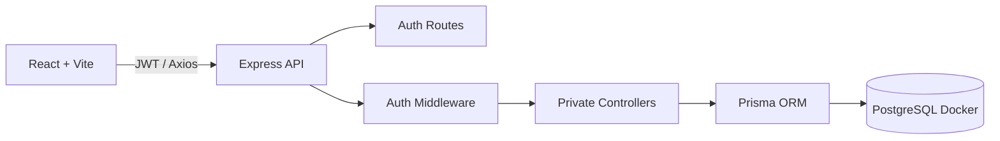
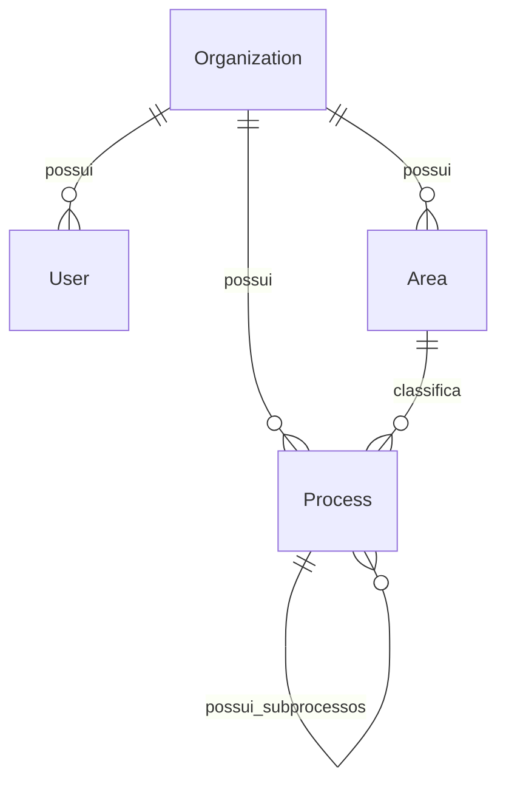

# Apresentacao Tecnica - ProcessHub

## 1. Visao geral

ProcessHub e uma plataforma SaaS multi-tenant para gestao corporativa de processos. O sistema permite que cada empresa opere em um workspace proprio, com usuarios, areas, processos, subprocessos e documentacao isolados dos demais workspaces.

A solucao combina arquitetura profissional de produto SaaS com uma experiencia visual moderna: autenticacao, JWT, hash de senha, isolamento por organizacao, Dashboard operacional, Process Explorer e gestao hierarquica de subprocessos.

## 2. Problema

Processos corporativos frequentemente ficam dispersos em planilhas, documentos, ferramentas pontuais e conhecimento informal. Isso gera baixa visibilidade sobre:

- areas responsaveis;
- donos de processo;
- ferramentas utilizadas;
- documentacao associada;
- status e prioridade;
- relacao entre processos e subprocessos;
- segregacao de dados entre empresas diferentes.

ProcessHub centraliza essa estrutura em um workspace seguro e navegavel.

## 3. Solucao entregue

- Tela de autenticacao para entrar ou criar conta.
- Criacao automatica de workspace ao cadastrar usuario.
- Edicao do nome do workspace pela sidebar.
- Login com JWT e persistencia de sessao no navegador.
- Senha armazenada como `passwordHash` com bcrypt.
- Middleware backend para validar token e escopo da organizacao.
- Modelagem multi-tenant com `Organization`, `User`, `Area` e `Process`.
- CRUD de areas e processos filtrado por `organizationId`.
- Process Explorer com raias por status, cards, subprocessos expansivos e drawer lateral.
- Dashboard operacional sem exposicao de dados de outros workspaces.

## 4. Arquitetura



Rotas publicas:

- `POST /auth/register`
- `POST /auth/login`

Rotas privadas:

- `GET /auth/me`
- `PUT /auth/workspace`
- `/areas`
- `/processes`

## 5. Multi-tenancy

O tenant da aplicacao e a `Organization`.

Cada usuario possui:

```ts
organizationId
```

Cada area e processo tambem possui:

```ts
organizationId
```

Depois do login, o token JWT carrega:

```ts
{
  userId,
  organizationId
}
```

O middleware valida o token e injeta esses dados na request. Todos os controllers privados usam esse escopo para consultar e alterar dados.

Exemplo:

```ts
where: {
  organizationId: req.user.organizationId
}
```

Esse desenho evita que um workspace acesse dados de outro.

## 6. Modelagem



Entidades:

- **Organization:** workspace/empresa.
- **User:** usuario autenticado, com email unico e senha com hash.
- **Area:** unidade organizacional do workspace.
- **Process:** processo ou subprocesso vinculado a area e organizacao.

Processos usam lista de adjacencia:

```prisma
parentId String?
parent   Process?
children Process[]
```

Essa estrutura permite subprocessos ilimitados sem criar tabelas por nivel.

## 7. Backend

Stack:

- Express
- TypeScript
- Prisma ORM
- PostgreSQL
- JWT
- bcrypt

Responsabilidades:

- criar usuario e workspace;
- autenticar credenciais;
- assinar e validar JWT;
- aplicar escopo multi-tenant;
- validar area, processo pai, status, prioridade e tipo;
- impedir ciclos de hierarquia;
- montar `/processes/tree` com `children` recursivo.

## 8. Frontend

Stack:

- React
- TypeScript
- Vite
- Tailwind CSS
- Axios

Fluxo visual:

- `/auth`: entrar ou criar conta/workspace.
- `ProtectedRoute`: bloqueia paginas privadas sem sessao.
- `AuthProvider`: persiste token, usuario e workspace.
- `Sidebar`: exibe usuario, workspace, edicao do workspace e logout.
- `Dashboard`: indicadores do workspace autenticado.
- `Areas`: CRUD de areas.
- `Process Explorer`: navegacao principal por processos e subprocessos.

## 9. UX/UI

- Visual limpo e corporativo.
- Tela de autenticacao centralizada e responsiva.
- Dashboard compacto para desktop.
- Processos organizados por status.
- Cards horizontais por raia, com navegacao por toque ou setas.
- Subprocessos expansivos/recolhiveis.
- Drawer lateral com informacoes completas do processo.
- Sidebar com contexto do workspace.

## 10. Seguranca

- Senha nunca e salva em texto puro.
- bcrypt gera `passwordHash`.
- JWT protege rotas privadas.
- `JWT_SECRET` fica no `.env`.
- Token carrega `userId` e `organizationId`.
- Controllers filtram tudo por workspace.
- Processo pai e area precisam pertencer ao mesmo workspace.
- Slug de workspace e unico.

## 11. Docker e ambiente local

Docker Compose e usado para subir PostgreSQL localmente:

```bash
docker compose up -d
```

Beneficios:

- setup rapido;
- banco padronizado;
- menos conflito com instalacoes locais;
- ambiente mais proximo de desenvolvimento profissional.

## 12. Execucao e qualidade

Comandos principais:

```bash
cd backend
npx.cmd prisma migrate deploy
npx.cmd prisma generate
npm run build

cd ../frontend
npm run lint
npm run build
```

## 13. Demonstracao sugerida

1. Abrir `/auth`.
2. Criar uma conta e uma empresa/workspace.
3. Mostrar o workspace na sidebar.
4. Editar o nome do workspace.
5. Criar uma area.
6. Criar processo e subprocesso.
7. Abrir o Process Explorer.
8. Demonstrar subprocessos expansivos e drawer lateral.
9. Fazer logout.
10. Criar outro workspace e mostrar isolamento dos dados.

## 14. Evolucoes futuras

- Convites de usuarios para workspace.
- Perfis e permissoes por papel.
- Recuperacao de senha.
- Refresh token e sessao mais robusta.
- Auditoria e historico de alteracoes.
- Upload e versionamento de documentos.
- Busca global e filtros avancados.
- Deploy cloud com HTTPS e secrets gerenciados.

## Fechamento

ProcessHub entrega uma base SaaS corporativa para gestao de processos: autenticacao, multi-tenancy, isolamento de dados, UX moderna e arquitetura preparada para evoluir.
