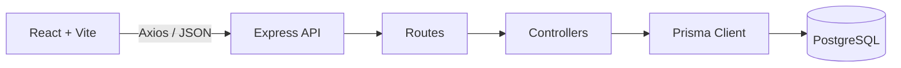

# Apresentacao Tecnica - ProcessHub

## 1. Contexto

Empresas em crescimento costumam ter processos espalhados entre planilhas, documentos, ferramentas internas e conhecimento informal. Isso dificulta entender quais areas existem, quais processos pertencem a cada area, quem e responsavel, quais ferramentas sao usadas e como subprocessos se relacionam.

O ProcessHub resolve esse problema como um workspace corporativo para gestao de processos, combinando cadastro estruturado, hierarquia recursiva e uma visualizacao moderna inspirada em plataformas SaaS de operacao.

## 2. Solucao

A aplicacao entrega tres modulos principais:

- **Dashboard operacional:** indicadores de areas, processos, subprocessos, prioridades e status.
- **Process Explorer:** board por status com cards navegaveis, subprocessos expansivos, filtros por area e drawer lateral de detalhes.
- **Areas:** CRUD da estrutura organizacional usada para classificar os processos.

O foco visual saiu de uma representacao BPMN/fluxo linear e passou para uma interface de produto: cards, raias, arvore expansivel, metricas compactas e detalhes contextuais.

## 3. Principais capacidades

| Capacidade | Implementacao |
| --- | --- |
| Separacao frontend/backend | React consome API REST JSON em Express. |
| Cadastro de areas | CRUD completo na tela Areas e na API `/areas`. |
| Cadastro de processos | CRUD completo na tela Processos e na API `/processes`. |
| Subprocessos ilimitados | Relacao recursiva com `parentId` na tabela `Process`. |
| Visualizacao moderna | Process Explorer com board vertical por status, cards horizontais, arvore expansivel e drawer. |
| Responsaveis, ferramentas e docs | Campos `responsibles`, `tools` e `documentation`. |
| Status e prioridade | Campos validados no backend e exibidos no Dashboard e nos cards. |
| Prevencao de ciclos | Validacao de ancestrais antes de alterar `parentId`. |
| Banco relacional | PostgreSQL com Prisma ORM e migrations. |
| Ambiente local | PostgreSQL via Docker Compose. |

## 4. Arquitetura



O frontend e responsavel pela experiencia visual e pelo consumo da API. O backend concentra validacoes, regras de integridade, montagem da arvore e persistencia no PostgreSQL.

## 5. Modelagem de processos

A hierarquia usa uma lista de adjacencia:

```prisma
parentId String?
parent   Process?
children Process[]
```

Quando `parentId` e nulo, o processo e raiz. Quando aponta para outro processo, ele vira subprocesso daquele item.

Essa escolha permite profundidade ilimitada, consultas simples e boa compatibilidade com uma UI em arvore.

## 6. Endpoint `/processes/tree`

O endpoint busca todos os processos e monta a hierarquia em memoria:

1. indexa processos por `id`;
2. adiciona `children` em cada item;
3. conecta cada processo ao seu `parentId`;
4. retorna apenas os processos raiz.

O frontend usa essa arvore para renderizar o Process Explorer, as contagens do Dashboard e os seletores de processo pai.

## 7. UX/UI

- Sidebar principal com navegacao entre Dashboard, Processos e Areas.
- Dashboard compacto para desktop, com indicadores visiveis sem rolagem.
- Process Explorer em raias verticais por status: Aberto, Em andamento, Em revisao e Fechado.
- Cards horizontais por status, com rolagem por gesto em mobile/tablet e setas no desktop.
- Subprocessos expansivos/recolhiveis dentro dos cards.
- Drawer lateral com resumo, responsaveis, ferramentas, documentacao, arvore e timeline operacional.
- Layout responsivo para desktop, tablet e mobile.

## 8. Boas praticas tecnicas

- Separacao clara entre frontend e backend.
- Controllers separados das rotas.
- Prisma centralizado em `src/lib/prisma.ts`.
- Migrations versionadas.
- Indices em `areaId` e `parentId`.
- Validacao backend para status, prioridade, tipo de execucao e ciclos hierarquicos.
- Exclusao segura de processos com remocao dos subprocessos descendentes.
- Componentes React divididos por responsabilidade.
- Build e lint do frontend validados.
- Build TypeScript do backend validado.

## 9. Melhorias futuras

- Autenticacao e perfis de acesso.
- Historico de alteracoes por processo.
- Upload e versionamento real de documentos.
- Busca global por processo, area, responsavel e ferramenta.
- Filtros avancados no Process Explorer.
- Testes automatizados de API e componentes.
- Deploy em ambiente cloud.

## 10. Roteiro de apresentacao

1. Comece pela dor: processos ficam dispersos e dificeis de acompanhar.
2. Mostre o Dashboard e os indicadores.
3. Mostre Areas como base organizacional.
4. Abra Processos e explique o Process Explorer.
5. Demonstre cards por status, subprocessos expansivos e drawer lateral.
6. Cadastre um processo e um subprocesso.
7. Explique `parentId` como base da hierarquia ilimitada.
8. Explique o backend: Express, controllers, Prisma e PostgreSQL.
9. Feche com a evolucao do produto: autenticacao, historico, anexos e deploy.

Frase de fechamento:

> O ProcessHub transforma processos corporativos em um workspace estruturado, navegavel e pronto para evoluir como produto SaaS de gestao operacional.
