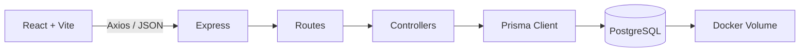

# Apresentação Técnica - ProcessHub

## 1. Problema do case

O case pede uma solução para organizar processos empresariais que normalmente ficam espalhados em planilhas, documentos e conhecimento informal. A dor principal é entender quais áreas existem, quais processos pertencem a cada área, quais subprocessos fazem parte da cadeia, quem é responsável, quais ferramentas são usadas e onde está a documentação.

## 2. Solução entregue

O ProcessHub centraliza esse mapeamento em uma aplicação web com três áreas principais:

- **Dashboard:** visão geral do mapa, indicadores e filtro por área.
- **Processos:** cadastro, edição, exclusão e fluxograma navegável.
- **Áreas:** gestão da estrutura organizacional.

O sistema transforma uma lista de processos em uma cadeia visual, facilitando a leitura por pessoas técnicas e por usuários de negócio.

## 3. Aderência ao case

| O que o case pede | Como o projeto atende |
| --- | --- |
| Cadastro de áreas | CRUD completo na tela de Áreas e na API `/areas`. |
| Cadastro de processos | CRUD completo na tela de Processos e na API `/processes`. |
| Subprocessos ilimitados | Relação recursiva com `parentId` na tabela `Process`. |
| Ferramentas e sistemas | Campo `tools` no processo. |
| Responsáveis | Campo `responsibles` no processo. |
| Documentação | Campo `documentation` no processo. |
| Visualização da cadeia | Fluxograma interativo com React Flow. |
| Status e prioridade | Campos próprios, indicadores e cores por prioridade. |
| Separação frontend/backend | React consome API REST JSON em Express. |
| Banco de dados | PostgreSQL com Prisma ORM. |
| Ambiente local reproduzível | PostgreSQL via Docker Compose. |

## 4. Arquitetura



O frontend renderiza a interface e chama a API. O backend recebe as requisições, valida os dados, executa regras de negócio e persiste tudo no PostgreSQL por meio do Prisma.

## 5. Modelagem de processos

A relação entre processos e subprocessos usa uma lista de adjacência:

```prisma
parentId String?
parent   Process?
children Process[]
```

Quando `parentId` é nulo, o item é um processo raiz. Quando `parentId` aponta para outro processo, ele se torna subprocesso daquele processo.

Essa escolha é simples e flexível porque permite qualquer profundidade sem criar tabelas extras para cada nível.

## 6. Endpoint `/processes/tree`

O endpoint busca todos os processos e monta a hierarquia em memória:

1. cria um mapa por `id`;
2. adiciona `children` em cada processo;
3. conecta cada processo ao seu pai usando `parentId`;
4. retorna apenas os processos raiz.

Assim, o frontend recebe a árvore pronta para desenhar o fluxograma.

## 7. Diferenciais do projeto

- Fluxograma navegável com zoom, arraste, toque em mobile/tablet e minimapa em telas maiores.
- Linhas e setas entre processo pai e subprocesso.
- Cores por prioridade para leitura rápida.
- Filtro por área no Dashboard e na tela de Processos.
- Validação no backend para evitar ciclo hierárquico.
- Validação de status, prioridade e tipo de execução.
- Docker para padronizar o banco local.
- Documentação objetiva para execução e defesa técnica.

## 8. Boas práticas usadas

- Separação entre frontend e backend.
- Separação entre routes e controllers.
- Prisma centralizado em `src/lib/prisma.ts`.
- Migrations versionadas.
- Índices em `areaId` e `parentId`.
- Interface em português.
- Componentes React separados por responsabilidade.
- Layout responsivo para desktop, tablet e mobile.

## 9. Melhorias futuras

- Autenticação e perfis de acesso.
- Upload real de documentos.
- Exportação do fluxograma em PDF ou imagem.
- Histórico de alterações.
- Testes automatizados.
- Filtros avançados por responsável, status e prioridade.
- Deploy em ambiente cloud.

## 10. Roteiro para apresentação

1. Comece pelo problema: processos empresariais ficam dispersos e difíceis de visualizar.
2. Mostre o Dashboard com indicadores e filtro por área.
3. Cadastre uma área.
4. Cadastre um processo e um subprocesso.
5. Mostre o fluxograma e explique as linhas entre pai e filho.
6. Explique o `parentId` como base dos subprocessos ilimitados.
7. Explique o backend: Express, controllers, Prisma e PostgreSQL.
8. Mostre o Docker como forma de reproduzir o banco localmente.
9. Feche destacando os diferenciais visuais e técnicos.

Frase de fechamento:

> O ProcessHub atende ao case ao transformar processos empresariais em uma estrutura cadastrável, documentada e visualmente navegável, usando uma arquitetura simples, moderna e preparada para evolução.
