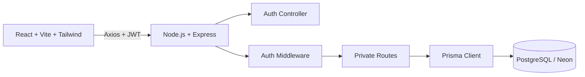
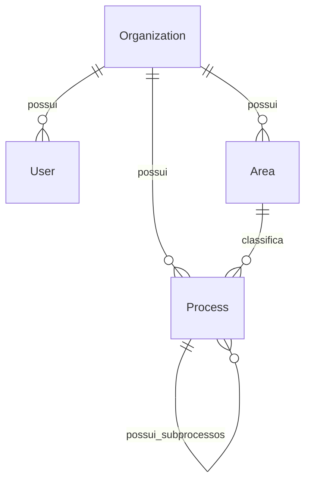

# Apresentacao Tecnica - ProcessHub SaaS

## 1. Visao geral

ProcessHub e uma plataforma SaaS multi-tenant para gestao corporativa de processos. A aplicacao permite que cada empresa trabalhe em seu proprio workspace, com usuarios, areas, processos, subprocessos e documentacao isolados por organizacao.

O produto foi construido como uma aplicacao full stack moderna, com autenticacao JWT, hash de senhas, API REST, PostgreSQL, Prisma ORM, frontend React e deploy em cloud com Vercel, Render e Neon.

## 2. Proposta do produto

Empresas costumam documentar processos em planilhas, fluxogramas estaticos, documentos soltos e ferramentas sem padrao. Isso dificulta a visualizacao de responsaveis, status, prioridades, subprocessos e documentacao associada.

O ProcessHub centraliza essa operacao em uma interface limpa e corporativa, com uma experiencia mais proxima de produtos como Jira, Linear, ClickUp, Monday e Notion.

## 3. Funcionalidades entregues

- Cadastro de usuario e criacao de workspace.
- Login com JWT.
- Sessao persistida no frontend.
- Logout seguro.
- Edicao do nome do workspace.
- CRUD de areas.
- CRUD de processos.
- Criacao de subprocessos em multiplos niveis.
- Arvore recursiva via `children`.
- Dashboard com indicadores do workspace.
- Process Explorer com cards por status.
- Drawer lateral com detalhes completos do processo.
- Isolamento completo de dados por organizacao.

## 4. Arquitetura



Camadas principais:

- **Frontend:** interface, autenticacao, rotas protegidas e consumo da API.
- **Backend:** regras de negocio, autenticacao, validacoes e endpoints REST.
- **Banco:** PostgreSQL com schema versionado por Prisma.
- **Infra local:** Docker Compose para subir PostgreSQL rapidamente.
- **Infra cloud:** Vercel, Render e Neon.

## 5. Multi-tenancy

O tenant da plataforma e a `Organization`.

Cada usuario pertence a uma organizacao:

```ts
organizationId
```

Areas e processos tambem possuem `organizationId`. Depois do login, o JWT carrega:

```ts
{
  userId,
  organizationId
}
```

O middleware de autenticacao valida o token e injeta os dados do usuario na request. A partir disso, todos os controllers privados filtram automaticamente por workspace.

Exemplo:

```ts
where: {
  organizationId: req.user.organizationId
}
```

Esse desenho impede que usuarios de um workspace acessem dados de outra empresa.

## 6. Modelo de dados



Entidades:

- **Organization:** representa a empresa ou workspace.
- **User:** representa o usuario autenticado.
- **Area:** representa uma area interna da empresa.
- **Process:** representa processo ou subprocesso.

Processos usam lista de adjacencia:

```prisma
parentId String?
parent   Process?
children Process[]
```

Essa abordagem permite hierarquias profundas sem criar colunas ou tabelas por nivel.

## 7. Backend

Stack:

- Node.js
- Express
- TypeScript
- Prisma ORM
- PostgreSQL
- JWT
- bcrypt

Responsabilidades:

- cadastrar usuario e workspace;
- autenticar credenciais;
- gerar JWT;
- proteger rotas privadas;
- aplicar isolamento por organizacao;
- validar area, status, prioridade e tipo do processo;
- impedir ciclos em subprocessos;
- montar a arvore de processos em `/processes/tree`;
- excluir processos com descendentes quando necessario.

## 8. Frontend

Stack:

- React
- TypeScript
- Vite
- Tailwind CSS
- Axios
- React Router DOM
- Lucide React

Fluxo:

1. Usuario acessa `/auth`.
2. Pode entrar ou criar uma nova conta.
3. Ao criar conta, tambem cria a empresa/workspace.
4. Depois do login, a aplicacao abre a area autenticada.
5. Dashboard, Areas e Processos carregam apenas dados da organizacao.
6. A sidebar exibe usuario, workspace, edicao do workspace e logout.

## 9. Experiencia de usuario

A interface foi pensada como produto SaaS enterprise:

- visual limpo e responsivo;
- layout corporativo com tons slate, sky e branco;
- cards modernos para processos;
- status organizados por secoes verticais;
- navegacao horizontal em processos dentro de cada status;
- subprocessos expansivos e recolhiveis;
- drawer lateral para detalhes completos;
- dashboard sem excesso de rolagem no desktop;
- autenticacao compacta e profissional.

## 10. Endpoints principais

| Metodo | Rota | Descricao |
| --- | --- | --- |
| POST | `/auth/register` | Cria usuario e workspace |
| POST | `/auth/login` | Autentica usuario |
| GET | `/auth/me` | Retorna sessao autenticada |
| PUT | `/auth/workspace` | Atualiza workspace |
| GET | `/areas` | Lista areas do workspace |
| POST | `/areas` | Cria area |
| PUT | `/areas/:id` | Atualiza area |
| DELETE | `/areas/:id` | Remove area |
| GET | `/processes/tree` | Retorna arvore de processos |
| POST | `/processes` | Cria processo ou subprocesso |
| PUT | `/processes/:id` | Atualiza processo |
| DELETE | `/processes/:id` | Remove processo |

Rotas privadas usam:

```http
Authorization: Bearer <token>
```

## 11. Seguranca

- Senhas nunca sao salvas em texto puro.
- bcrypt gera `passwordHash`.
- JWT protege as rotas privadas.
- `JWT_SECRET` fica em variavel de ambiente.
- Token inclui `userId` e `organizationId`.
- Controllers filtram dados pelo workspace autenticado.
- Area e processo precisam pertencer ao mesmo workspace.
- Processo pai precisa estar na mesma organizacao.
- Slug de organizacao e unico.
- A arvore de subprocessos possui validacao contra ciclos.

## 12. Docker e ambiente local

O projeto usa Docker Compose para padronizar o banco local:

```bash
docker compose up -d
```

Beneficios:

- setup rapido;
- PostgreSQL isolado;
- menos conflito com instalacoes locais;
- ambiente mais proximo de um fluxo profissional.

## 13. Deploy

Infraestrutura usada:

- **Frontend:** Vercel.
- **Backend:** Render.
- **Banco:** Neon PostgreSQL.

O deploy em cloud demonstra separacao real entre cliente, API e banco de dados.

Observacao: no plano gratuito do Render, a primeira requisicao pode demorar alguns segundos caso a API esteja inativa.

## 14. Como demonstrar

1. Abrir a aplicacao hospedada na Vercel.
2. Criar uma conta e uma empresa.
3. Mostrar login e workspace na sidebar.
4. Criar uma area.
5. Criar um processo raiz.
6. Criar subprocessos em mais de um nivel.
7. Abrir o Process Explorer.
8. Expandir e recolher subprocessos.
9. Abrir o drawer de detalhes.
10. Editar o workspace.
11. Fazer logout.
12. Criar outro workspace e mostrar que os dados nao aparecem.

## 15. Qualidade e validacao

Comandos usados no projeto:

```bash
cd backend
npm run build

cd ../frontend
npm run lint
npm run build
```

## 16. Evolucoes futuras

- Convites de usuarios para workspace.
- Controle de permissoes por papel.
- Recuperacao de senha.
- Refresh token.
- Auditoria de alteracoes.
- Upload de documentos.
- Busca global.
- Filtros avancados.
- Testes automatizados de API e frontend.

## Fechamento

ProcessHub entrega uma base profissional de produto SaaS: autenticacao, isolamento multi-tenant, CRUD completo, hierarquia recursiva de processos, UX corporativa e deploy full stack em cloud.
